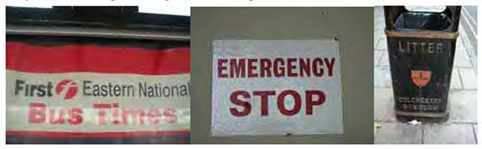
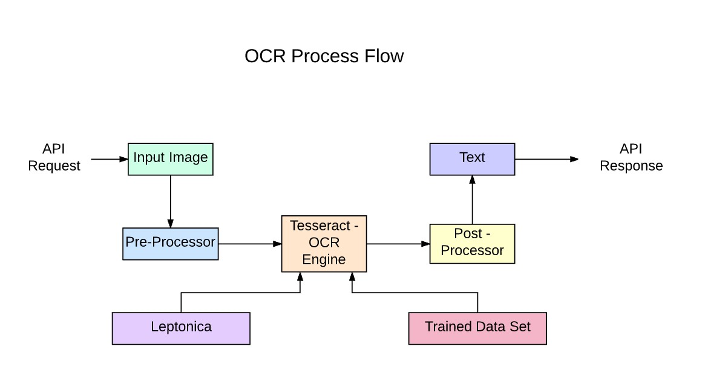
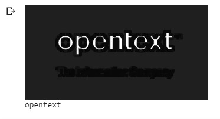
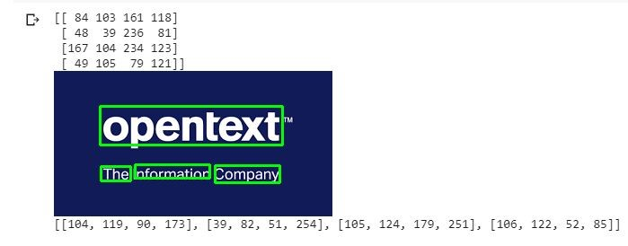
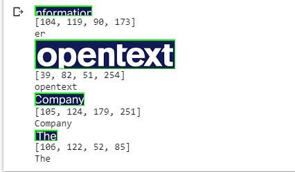

# Natural Scene Text Detection

## Optical Character Recognition

**OCR (Optical Character Recognition):** In other words, OCR systems transform a two-dimensional image of text, that could contain machine-printed or handwritten text from its image representation into machine-readable text. OCR as a process generally consists of several sub-processes to perform as accurately as possible. The subprocesses are:
*	Preprocessing of the Image
*	Text Localization
*	Character Segmentation
*	Character Recognition
*	Post Processing

The sub-processes in the list above of course can differ, but these are roughly steps needed to approach automatic character recognition. In OCR software, its main aim is to identify and capture all the unique words using different languages from written text characters.
For almost two decades, optical character recognition systems have been widely used to provide automated text entry into computerized systems. Yet in all this time, conventional OCR systems have never overcome their inability to read more than a handful of type fonts and page formats. Proportionally spaced type (which includes virtually all typeset copy), laser printer fonts, and even many non-proportional typewriter fonts, have remained beyond the reach of these systems. As a result, conventional OCR has never achieved more than a marginal impact on the total number of documents needing conversion into digital form.
Next-generation OCR engines deal with these problems mentioned above really well by utilizing the latest research in the area of deep learning. By leveraging the combination of deep models and huge datasets publicly available, models achieve state-of-the-art accuracies on given tasks. Nowadays it is also possible to generate synthetic data with different fonts using generative adversarial networks and a few other generative approaches.
Optical Character Recognition remains a challenging problem when text occurs in unconstrained environments, like natural scenes, due to geometrical distortions, complex backgrounds, and diverse fonts. The technology still holds immense potential due to the various use cases of deep learning-based OCR:
*	building license plate readers
*	digitizing invoices
*	digitizing menus
*	digitizing ID cards

**Why is natural scene text detection so challenging?**

Detecting text in constrained, controlled environments can typically be accomplished by using heuristic-based approaches, such as exploiting gradient information or the fact that text is typically grouped into paragraphs and characters appear on a straight line.
Natural scene text detection is different though — and much more challenging.
Due to the proliferation of cheap digital cameras, and not to mention the fact that nearly every smartphone now has a camera, we need to be highly concerned with the conditions the image was captured under — and furthermore, what assumptions we can and cannot make. I’ve included a summarized version of the natural scene text detection challenges described by Celine Mancas-Thillou and Bernard Gosselin in their excellent 2017 paper, Natural Scene Text Understanding below:
*	Image/sensor noise: Sensor noise from a handheld camera is typically higher than that of a traditional scanner. Additionally, low-priced cameras will typically interpolate the pixels of raw sensors to produce real colours.
*	Viewing angles: Natural scene text can naturally have viewing angles that are not parallel to the text, making the text harder to recognize.
*	Blurring: Uncontrolled environments tend to have blur, especially if the end user is utilizing a smartphone that does not have some form of stabilization.
*	Lighting conditions: We cannot make any assumptions regarding our lighting conditions in natural scene images. It may be near dark, the flash on the camera may be on, or the sun may be shining brightly, saturating the entire image.
*	Resolution: Not all cameras are created equal — we may be dealing with cameras with sub-par resolution.
*	Non-paper objects: Most, but not all, paper is not reflective (at least in the context of the paper you are trying to scan). Text in natural scenes may be reflective, including logos, signs, etc.
*	Non-planar objects: Consider what happens when you wrap text around a bottle — the text on the surface becomes distorted and deformed. While humans may still be able to easily “detect” and read the text, our algorithms will struggle. We need to be able to handle such use cases.
*	Unknown layout: We cannot use any a priori information to give our algorithms “clues” as to where the text resides.

## Tesseract OCR
Tesseract is open source text recognition (OCR) Engine, available under the Apache 2.0 license. It can be used directly, or (for programmers) using an API to extract printed text from images. It supports a wide variety of languages. Tesseract doesn't have a built-in GUI, but there are several available from the 3rdParty page. Tesseract is compatible with many programming languages and frameworks through wrappers that can be found here. It can be used with the existing layout analysis to recognize text within a large document, or it can be used in conjunction with an external text detector to recognize text

Tesseract 4.00 includes a new neural network subsystem configured as a text line recognizer. It has its origins in OCRopus' Python-based LSTM implementation but has been redesigned for Tesseract in C++. The neural network system in Tesseract pre-dates TensorFlow but is compatible with it, as there is a network description language called Variable Graph Specification Language (VGSL), that is also available for TensorFlow.
To recognize an image containing a single character, we typically use a Convolutional Neural Network (CNN). Text of arbitrary length is a sequence of characters, and such problems are solved using RNNs and LSTM is a popular form of RNN.
Now let us try to use Tesseract OCR for natural scene text detection.

## OCR with Pytesseract and OpenCV
1. Pytesseract is a wrapper for Tesseract-OCR Engine. It is also useful as a stand-alone invocation script to Tesseract, as it can read all image types supported by the Pillow and Leptonica imaging libraries, including jpeg, png, gif, bmp, tiff, and others.
2. Now, import the Pytesseract library. 
3. Load the images and the arguments required in the Google Colab
4. Create a separate original copy and clone copy for future purposes. Save the tesseract configuration in the cus_config variable as per the required page segment mode. Let us choose the page segmentation mode 6 (psm 6) i.e. “Assume a single uniform block of text”, as it gives the best results for our chosen example.

The above output shows that the Tesseract OCR failed to detect and recognize a lot of text present in the image. One of the basic performance improvement methods while using an OCR is to convert the image into Grayscale before passing it into the OCR.
5. Let us try a few more preprocessing methods such as:-
*	Greyscaling
*	Thresholding
*	Eroding

We can see that the performance of Tesseract OCR is not very good for natural scene text detection. This is mainly due to the lack of constrained examples since Tesseract gives the best results for constrained examples.
One way of improving performance is better detection of the text region in the images. Thankfully, we have the EAST algorithm (Efficient and Accurate Scene Text) which gives very good performance in detecting text regions in the image.
Thus, in the latter part let us try running the Tesseract OCR after the text region detection of the EAST algorithm.

## The EAST deep learning text detector
With the release of OpenCV 3.4.2 and OpenCV 4, we can now use a deep learning-based text detector called EAST, which is based on Zhou et al.’s 2017 paper, EAST: An Efficient and Accurate Scene Text Detector.
We call the algorithm “EAST” because it’s an: Efficient and Accurate Scene Text detection pipeline.
The EAST pipeline is capable of predicting words and lines of text at arbitrary orientations on 720p images, and furthermore, can run at 13 FPS, according to the authors.
Perhaps most importantly, since the deep learning model is end-to-end, it is possible to sidestep computationally expensive sub-algorithms that other text detectors typically apply, including candidate aggregation and word partitioning.
To build and train such a deep learning model, the EAST method utilizes novel, carefully designed loss functions.

## Implementing our text detector with OpenCV
Before we get started, I want to point out that you will need at least OpenCV 3.4.2 (or OpenCV 4) installed on your system to utilize OpenCV’s EAST text detector, so if you haven’t already installed OpenCV 3.4.2 or better on your system.
1. Next, make sure you have imutils installed/upgraded on your system as well.
2. To begin, we import our required packages and modules on Lines 2-8. Notably, we import NumPy, OpenCV, and non_max_suppression from imutils.object_detection
3. We load and copy our input image.
From there, determine the ratio of the original image dimensions to new image dimensions (based on the command line argument provided for width and height).
Then we resize the image, ignoring the aspect ratio.
In order to perform text detection using OpenCV and the EAST deep learning model, we need to extract the output feature maps of two layers:
4.	* The first layer is our output sigmoid activation which gives us the probability of a region containing text or not.
	* The second layer is the output feature map that represents the “geometry” of the image — we’ll be able to use this geometry to derive the bounding box coordinates of the text in the input image
Let’s load the OpenCV’s EAST text detector.
5. We load the neural network into memory using cv2.dnn.readNet by passing the path to the EAST detector.
Then we prepare our image by converting it to a blob.
To predict text we can simply set the blob as input and call net.forward. These lines are surrounded by grabbing timestamps so that we can print the elapsed time on.
By supplying layer names as a parameter to net.forward, we are instructing OpenCV to return the two feature maps that we are interested in:
*	The output geometry map used to derive the bounding box coordinates of text in our input images
*	And similarly, the scores map, contains the probability of a given region containing text
We’ll need to loop over each of these values, one-by-one.
6. We start off by grabbing the dimensions of the scores volume and then initializing two lists:
*	rects: Stores the bounding box (x, y)-coordinates for text regions
*	confidences: Stores the probability associated with each of the bounding boxes in rects
We’ll later be applying non-maxima suppression to these regions.
Looping over the rows begins on 9. Extract our scores and geometry data for the current row, y.
Next, we loop over each of the column indexes for our currently selected row.
For every row, we begin looping over the columns.
We need to filter out weak text detections by ignoring areas that do not have sufficiently high probability.
The EAST text detector naturally reduces volume size as the image passes through the network — our volume size is actually 4x smaller than our input image so we multiply by four to bring the coordinates back into respect of our original image.
From there, Lines 6-15  derive the bounding box coordinates for the text area.
We then update our rects and confidences lists, respectively.
7. The final step is to apply non-maxima suppression to our bounding boxes to suppress weak overlapping bounding boxes and then display the resulting text predictions.4

With the EAST algorithm we can see that our text regions are better detected and compared to the Plain Pytesseract OCR. The coordinates of the text region in the image are stored in the ROI list. Let us pass on the regions of interest to the Pytesseract OCR for recognition.

We can see that the Pytesseract OCR has recognized the majority of the text regions correctly. The recognition text can be written into text editing files or databases and can be used for a variety of different purposes.

## SNAPSHOTS

Fig. Sample Image

Fig. Pytesseract OCR output

Fig. Pytesseract output after preprocessing through Greyscaling

Fig. Pytesseract output after preprocessing with Greyscaling, thresholding and eroding

Fig. EAST algorithm text detection output with bounded Regions of Interest (ROI)

Fig. Pytesseract OCR text recognition at ROI detected by the EAST detection algorithm

## RESULT AND DISCUSSION
Tesseract works best when there is a clear segmentation of the foreground text from the background. In practice, it can be extremely challenging to guarantee these types of setup. There are a variety of reasons you might not get good quality output from Tesseract like if the image has noise in the background. The better the image quality (size, contrast, lightning), the better the recognition result. It requires a bit of preprocessing to improve the OCR results, images need to be scaled appropriately, have as much image contrast as possible, and the text must be horizontally aligned. Tesseract OCR is quite powerful but does have the following limitations.
Tesseract limitations are summed up in the list.
*	The OCR is not as accurate as some commercial solutions available to us.
*	Doesn't do well with images affected by artifacts including partial occlusion, distorted perspective, and complex background.
*	It is not capable of recognizing handwriting.
*	It may find gibberish and report this as OCR output.
*	If a document contains languages outside of those given in the -l LANG arguments, results may be poor.
*	It is not always good at analyzing the natural reading order of documents. For example, it may fail to recognize that a document contains two columns, and may try to join text across columns.
*	Poor-quality scans may produce poor-quality OCR.
*	It does not expose information about what font family text belongs to.

The maximal size of text instances the detector can handle is proportional to the receptive field of the network. This limits the capability of the network to predict even longer text regions like text lines running across the images. Also, the algorithm might miss or give imprecise predictions for vertical text instances as they take only a small portion of text regions in the ICDAR 2015 training set. 5. Conclusion and Future Work We have presented a scene text detector that directly produces word or line-level predictions from full images with a single neural network. By incorporating proper loss functions, the detector can predict either rotated rectangles or quadrangles for text regions, depending on specific applications. The experiments on standard benchmarks confirm that the proposed algorithm substantially outperforms previous methods in terms of both accuracy and efficiency. Possible directions for future research include: (1) adapting the geometry formulation to allow direct detection of curved text; (2) integrating the detector with a text recognizer; (3) extending the idea to general object detection.
### Results:
The code uses the OpenCV EAST model for text detection and Tesseract for text recognition. PSM for the Tesseract has been set according to the image. It is important to note that Tesseract normally requires a clear image to work well.
In the project, we also saw the limitations exhibited by the Tesseract OCR. And performance improvements when it is combined with better text detection and segmentation algorithms.
In our current implementation, we did not consider rotating bounding boxes due to their complexity to implement. But in the real scenario where the text is rotated, the above code will not work well. Also, whenever the image is not very clear, tesseract will have difficulty to recognize the text properly.
We cannot expect the OCR model to be 100 % accurate. Still, we have achieved good results with the EAST model and Tesseract. Adding more filters for processing the image would help in improving the performance of the model.
